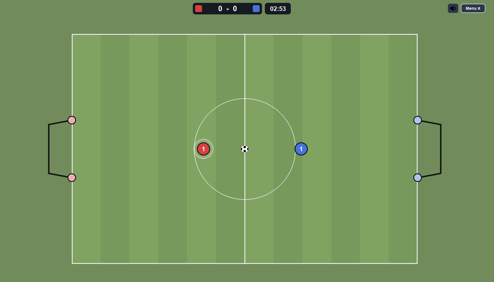
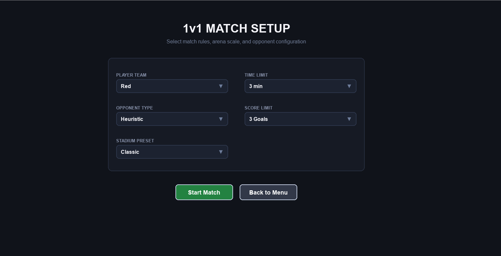

# Haxball 2D AI — Autonomous RL Soccer Game


## 1. Giới thiệu

* **Haxball là gì?** Tựa game thể thao 2D góc nhìn trên xuống kết hợp giữa bóng đá và air-hockey. Hai đội (Đỏ và Xanh) điều khiển các đĩa tròn di chuyển theo 8 hướng và sút bóng vào khung thành đối phương trong phạm vi thời gian hoặc điểm số quy định.
* **Dự án thực hiện những gì?**
  * Tự xây dựng engine vật lý 2D (sub-stepped circle collisions, phản xạ đàn hồi, co giãn tỷ lệ sân động).
  * Huấn luyện AI đá bóng tự hành bằng PPO kết hợp Curriculum Learning và Self-Play qua hơn 50 triệu bước.
  * Tối ưu hóa suy luận (inference) bằng Pure NumPy: trích xuất trọng số sang file nén `.npz`, loại bỏ hoàn toàn dependency PyTorch (~2 GB) khi chơi game, đạt độ trễ suy luận $< 0.05\text{ ms}$ trên CPU.

---

## 2. Cài đặt và Khởi chạy

### Thư viện yêu cầu (`requirements.txt`)
Để trải nghiệm trò chơi, hệ thống chỉ cần 2 thư viện nền tảng:
```text
pygame>=2.5.0
numpy>=1.24.0
```

### Các bước khởi chạy
```bash
# 1. Tạo môi trường ảo và kích hoạt
python3 -m venv .venv
source .venv/bin/activate # Trên Windows: .venv/Scripts/activate

# 2. Cài đặt thư viện tối thiểu
pip install -r requirements.txt

# 3. Chạy trò chơi
python3 main.py # Trên Windows: python main.py

```

---

## 3. Demo & Tính năng trò chơi

* **Link video demo:** [Xem demo trên Google Drive](https://drive.google.com/file/d/1KfDirdfHWZtgQuQcx9MR52YdhWtn-OA6/view?usp=sharing)

Chế độ **Chơi nhanh (Quick Play)** cho phép thiết lập:

* **Phe thi đấu**: Đội Đỏ (Red) hoặc Đội Xanh (Blue).
* **Thời gian trận đấu**: Vô hạn hoặc từ 1 đến 15 phút.
* **Giới hạn điểm**: Vô hạn hoặc từ 1 đến 15 bàn thắng.
* **Kích thước sân**: Sân nhỏ (`Small`), Truyền thống (`Classic`), Sân lớn (`Big`), Khổng lồ (`Huge`).


### Hệ thống đối thủ AI

* **Heuristic Bot**: AI điều khiển theo luật hình học giải tích (rule-based), tự động tính góc chặn bóng, góc sút và phòng ngự theo thời gian thực.
* **Easy RL Agent (Stage 2)**: Huấn luyện 25 triệu bước đối đầu trực tiếp với Heuristic Bot. Thành thạo kỹ năng áp sát, tranh chấp bóng và dứt điểm cơ bản.
* **Medium RL Agent (Stage 3)**: Huấn luyện 25 triệu bước thông qua cơ chế Self-Play / League (đấu với Heuristic, chính mình và các phiên bản trong quá khứ). Biết rê dắt đổi hướng, bật tường và sút góc hẹp.




## 4. Cấu trúc dự án

```text
.
├── assets/          # Sprites bóng, sân cỏ, font retro, audio & weights (.npz, .onnx)
├── config/          # Cấu hình game, thông số vật lý và thiết lập trận đấu
├── src/
│   ├── bots/        # Heuristic AI (Rule-based)
│   ├── engine/      # Physics 2D, entities, pitch logic & controllers
│   ├── game/        # Quản lý đồ họa Pygame, camera tracking, FSM & UI
│   └── rl/          # Trích xuất observation 80-D, suy luận NumPy & mạng PPO
├── tools/           # Script trích xuất weights (PT -> NPZ/ONNX) & test parity
├── training/        # Checkpoints và notebooks huấn luyện PPO (Stage 1 -> 4)
├── main.py          # Entry point khởi chạy ứng dụng
└── requirements.txt # Danh sách dependencies tối thiểu

```